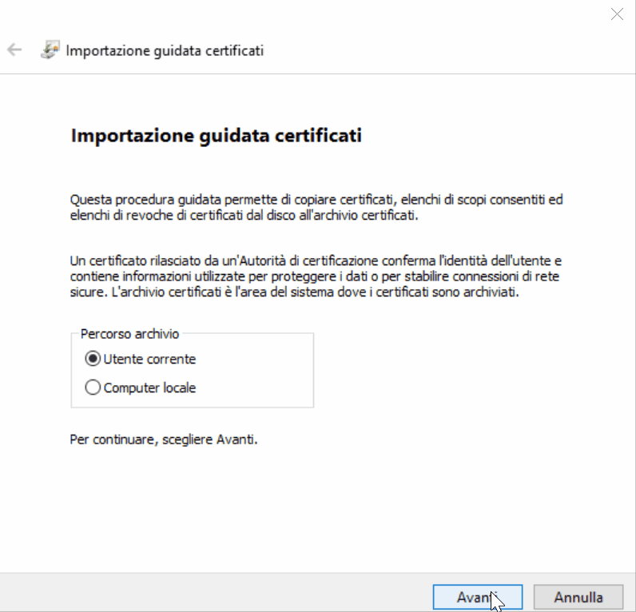

# Cert Demo with ASP.NET Core 3
Simple HTTPS ASP.NET Core application with custom self-signed certificate.

 * See certificate configuration in [appsettings.Development.json](appsettings.Development.json)
 * File [localhost.pfx](localhost.pfx) was generated with these two [Openssl for Windows](https://wiki.openssl.org/index.php/Binaries) commands.
   ```
   openssl req -x509 -sha256 -nodes -days 3650 -newkey rsa:2048 -keyout localhost.key -out localhost.crt -subj "/C=IT/ST=Provincia/L=Comune/O=Organization/OU=IT Department/CN=localhost/" -addext "subjectAltName=DNS:localhost"

   openssl pkcs12 -export -out localhost.pfx -inkey localhost.key -in localhost.crt 
   ```
 * File [localhost.pfx](localhost.pfx) must be installed in Windows first. Double click it, then follow the procedure (password is `demo`).

 

 You might also check this helpful article by humankode.
 https://www.humankode.com/asp-net-core/develop-locally-with-https-self-signed-certificates-and-asp-net-core